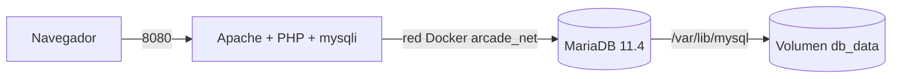

# 🕹️ Salón Recreativo — Práctica final RA1

**Módulo:** Implantación de Aplicaciones Web (0376)  
**Curso:** 2.º ASIX  
**Proyecto:** Despliegue de una web de ranking de récords con Apache, PHP y MariaDB usando Docker Compose.

---

## 1. Descripción del proyecto

El objetivo de esta práctica es desplegar en local una aplicación web para un salón recreativo que muestra un ranking de récords.

La aplicación utiliza dos servicios:

- **Web:** Apache + PHP 8.3.
- **Base de datos:** MariaDB 11.4.

Los dos servicios se ejecutan en contenedores Docker y se comunican mediante una red interna. La aplicación usa el usuario `jugador` para conectarse a MariaDB y las credenciales reales se guardan en `.env`, que no se sube a GitHub.

---

## 2. Tecnologías utilizadas

- Docker
- Docker Compose
- Apache
- PHP 8.3
- `mysqli`
- MariaDB 11.4
- Git y GitHub
- HTML
- JavaScript
- Mermaid

---

## 3. Estructura del proyecto

```text
salon-recreativo/
├── docker-compose.yml
├── Dockerfile
├── .env
├── .env.example
├── .gitignore
├── README.md
├── db/
│   └── init.sql
└── src/
    └── index.php
```

- `docker-compose.yml`: define los servicios, red, volumen y dependencias.
- `Dockerfile`: construye la imagen personalizada del servidor web.
- `.env`: contiene credenciales reales y no se sube al repositorio.
- `.env.example`: documenta las variables necesarias sin contraseñas reales.
- `.gitignore`: evita versionar `.env`.
- `db/init.sql`: inicializa la base de datos.
- `src/index.php`: aplicación PHP.
- `README.md`: documentación de la práctica.

---

## 4. Arquitectura



Flujo:

1. El navegador accede a `http://localhost:8080`.
2. Docker redirige el puerto 8080 del host al puerto 80 del contenedor web.
3. Apache ejecuta PHP.
4. PHP usa `mysqli` para conectarse a MariaDB.
5. MariaDB devuelve los datos de `ranking`.
6. PHP genera la página que recibe el navegador.

---

# Nivel 1 · Arranque de la base de datos

## 5. Variables de entorno

El fichero `.env` contiene:

```env
MARIADB_ROOT_PASSWORD=CAMBIAR
MARIADB_DATABASE=arcade
MARIADB_USER=jugador
MARIADB_PASSWORD=CAMBIAR
```

Las contraseñas reales no se incluyen en el repositorio.

El servicio web no recibe la contraseña de `root`, porque solo necesita las credenciales del usuario `jugador`. Esto aplica el **principio de mínimo privilegio**.

---

## 6. MariaDB, volumen y healthcheck

MariaDB usa una versión concreta:

```yaml
image: mariadb:11.4
```

No se usa `latest` para evitar cambios inesperados de versión.

Los datos de MariaDB se guardan en:

```text
/var/lib/mysql
```

y se conectan al volumen:

```text
db_data
```

Así los datos pueden persistir aunque se elimine el contenedor.

Healthcheck:

```yaml
healthcheck:
  test: ["CMD", "healthcheck.sh", "--connect", "--innodb_initialized"]
  interval: 5s
  retries: 10
```

El servicio web espera a que la base de datos esté sana:

```yaml
depends_on:
  db:
    condition: service_healthy
```

---

## 7. Comprobación de los servicios

```bash
docker compose up -d --build
docker compose ps
```

Resultado comprobado:

```text
NAME                     IMAGE                  SERVICE   STATUS                   PORTS
salon-recreativo-db-1    mariadb:11.4           db        Up (...) (healthy)       3306/tcp
salon-recreativo-web-1   salon-recreativo-web   web       Up (...)                 0.0.0.0:8080->80/tcp
```

La base de datos aparece como `healthy`.

---

## 8. Acceso a MariaDB

```bash
docker compose exec db mariadb -u jugador -p arcade
```

Comprobación de tablas:

```sql
SHOW TABLES;
```

Resultado:

```text
+------------------+
| Tables_in_arcade |
+------------------+
| ranking          |
+------------------+
```

Consulta:

```sql
SELECT * FROM ranking;
```

Resultado:

```text
+----+--------------------+----------------+--------+
| id | jugador            | juego          | puntos |
+----+--------------------+----------------+--------+
|  1 | PAC-ANA            | Pac-Man        |  48200 |
|  2 | MARIO_84           | Donkey Kong    |  35100 |
|  3 | LARA_C             | Tetris         |  61750 |
|  4 | NEO                | Space Invaders |  27900 |
|  5 | BIMBA_XL           | Pac-Man        |  52300 |
|  6 | ZELDA              | Tetris         |  58400 |
|  7 | R2D2               | Space Invaders |  31200 |
|  8 | TRON               | Donkey Kong    |  29800 |
|  9 | MONEDA-1: ARC-7X3K | secreto        |      0 |
+----+--------------------+----------------+--------+
```

---

## 9. Permisos del usuario `jugador`

```sql
SHOW GRANTS;
```

Resultado:

```text
GRANT USAGE ON *.* TO `jugador`@`%` IDENTIFIED BY PASSWORD '...'
GRANT ALL PRIVILEGES ON `arcade`.* TO `jugador`@`%`
```

El usuario `jugador` tiene permisos sobre todas las tablas de la base de datos `arcade`.

No se utiliza `root` porque la aplicación no necesita privilegios administrativos. Usar un usuario específico reduce el impacto en caso de que la aplicación sea comprometida.

---

## 10. Persistencia

Primera prueba:

```bash
docker compose down
docker compose up -d
```

Los datos siguieron existiendo porque el volumen `db_data` se conserva.

Segunda prueba:

```bash
docker compose down -v
docker compose up -d
```

La opción `-v` elimina también el volumen. Al volver a levantar el proyecto, MariaDB crea un volumen nuevo y vuelve a ejecutar `db/init.sql`.

**Diferencia:**

```text
docker compose down
→ elimina contenedores y red
→ conserva volúmenes

docker compose down -v
→ elimina contenedores y red
→ elimina también los volúmenes
```

`init.sql` solo se ejecuta cuando el volumen de la base de datos está vacío.

---

## 🪙 Moneda 1

```text
ARC-7X3K
```

---

# Nivel 2 · Conexión desde PHP

## 11. ¿Qué es un Dockerfile?

Un Dockerfile contiene las instrucciones para construir una imagen Docker propia.

```text
Dockerfile
→ cómo se construye una imagen

docker-compose.yml
→ cómo se ejecutan y conectan los servicios
```

---

## 12. Dockerfile utilizado

```dockerfile
FROM php:8.3-apache

RUN docker-php-ext-install mysqli

RUN sed -i 's/^ServerTokens .*/ServerTokens Prod/' /etc/apache2/conf-available/security.conf \
    && sed -i 's/^ServerSignature .*/ServerSignature Off/' /etc/apache2/conf-available/security.conf

RUN printf "expose_php = Off\n" > /usr/local/etc/php/conf.d/security.ini

COPY src/ /var/www/html/
```

- `FROM`: usa `php:8.3-apache` como imagen base.
- `RUN docker-php-ext-install mysqli`: instala la extensión necesaria para conectar PHP con MariaDB.
- `COPY`: copia `src/` a `/var/www/html/`.

El servicio web usa:

```yaml
web:
  build: .
```

Después de modificar el Dockerfile se reconstruye:

```bash
docker compose up -d --build
```

---

## 13. Comprobación del build

Durante la construcción se ejecutaron correctamente:

```text
[1/3] FROM php:8.3-apache
[2/3] RUN docker-php-ext-install mysqli
[3/3] COPY src/ /var/www/html/
```

La imagen creada fue:

```text
salon-recreativo-web
```

---

## 14. Servidor y cliente

**Servidor:** PHP se ejecuta dentro del contenedor web y se conecta a MariaDB mediante `mysqli`.

**Cliente:** JavaScript se ejecuta en el navegador del usuario.

Las horas pueden ser diferentes porque PHP usa la configuración horaria del servidor o contenedor y JavaScript usa la hora y zona horaria del navegador.

Durante la práctica se observó una diferencia de dos horas entre la hora PHP y la hora del navegador.

---

## 🪙 Moneda 2

```text
ARC-Q9M2
```

---

# Nivel 3 · Seguridad

## 15. `.env` fuera del repositorio

```bash
git ls-files
```

Resultado comprobado:

```text
.env.example aparece
.env NO aparece
```

Por tanto, las credenciales reales no están versionadas.

---

## 16. Contraseñas fuera del historial

```bash
git log -p | grep -F "<contraseña>"
```

Resultado:

```text
Sin salida.
```

Esto confirma que la contraseña comprobada no aparece en el historial de Git.

---

## 17. Puerto 3306 no publicado

```bash
docker compose ps
```

Resultado:

```text
salon-recreativo-db-1    mariadb:11.4           ...   3306/tcp
salon-recreativo-web-1   salon-recreativo-web   ...   0.0.0.0:8080->80/tcp
```

MariaDB escucha en `3306/tcp` dentro de Docker, pero no existe un mapeo `0.0.0.0:3306->3306/tcp`. Por tanto, el puerto de la base de datos no está publicado en el host.

---

## 18. La aplicación usa `jugador`

```bash
docker compose exec web printenv DB_USER
```

Resultado:

```text
jugador
```

La aplicación no utiliza `root`.

---

## 19. Ocultar versiones de Apache y PHP

Apache se configura con:

```text
ServerTokens Prod
ServerSignature Off
```

PHP se configura con:

```text
expose_php = Off
```

Comprobación:

```bash
curl -I http://localhost:8080
```

Resultado real:

```text
HTTP/1.1 200 OK
Date: Tue, 06 Oct 2026 07:29:15 GMT
Server: Apache
Content-Type: text/html; charset=UTF-8
```

Comprobaciones:

- Apache no muestra su número de versión.
- No aparece `X-Powered-By`.
- PHP no revela su versión.
- La web sigue funcionando con `200 OK`.

---

## 🪙 Moneda 3

```text
PENDIENTE DE LA PROFESORA
```

La profesora debe comprobar:

```bash
curl -I http://localhost:8080
docker compose ps
```

Cuando entregue la moneda, se sustituirá este texto por el código correspondiente.

---

# 20. Despliegue local

```bash
git clone <URL_DEL_REPOSITORIO>
cd salon-recreativo
cp .env.example .env
```

Editar `.env` y establecer dos contraseñas diferentes.

Después:

```bash
docker compose up -d --build
docker compose ps
```

Acceso:

```text
http://localhost:8080
```

Parar conservando datos:

```bash
docker compose down
```

Parar eliminando también los volúmenes:

```bash
docker compose down -v
```

---

# 21. Despliegue en Play with Docker

```bash
git clone <URL_DEL_REPOSITORIO>
cd salon-recreativo
cp .env.example .env
vi .env
docker compose up -d --build
docker compose ps
```

Después se abre el puerto `8080` desde Play with Docker.

Comprobación:

```bash
curl -I http://localhost:8080
```

---

# 22. Problemas que me encontré y cómo los resolví

## Problema 1 · PHP no tenía `mysqli`

Al principio la web mostraba que PHP no tenía la extensión `mysqli`.

**Causa:** `php:8.3-apache` necesitaba esa extensión para que la aplicación pudiera conectarse a MariaDB.

**Solución:** crear un Dockerfile con:

```dockerfile
RUN docker-php-ext-install mysqli
```

y reconstruir:

```bash
docker compose up -d --build
```

Después de hacerlo, la web pudo conectarse a la base de datos y mostrar el ranking.

### Problema 2 · Persistencia de los datos

`docker compose down` no eliminaba los datos porque estaban almacenados en `db_data`.

Para eliminar también el volumen fue necesario usar:

```bash
docker compose down -v
```

Al volver a levantar el proyecto, MariaDB volvió a ejecutar `init.sql`.

---

# 23. Resumen de monedas

| Nivel | Moneda |
|---|---|
| Nivel 1 | `ARC-7X3K` |
| Nivel 2 | `ARC-Q9M2` |
| Nivel 3 | Pendiente de la profesora |

---

# 24. Comandos útiles

```bash
docker compose up -d --build
docker compose ps
docker compose logs
docker compose exec db mariadb -u jugador -p arcade
docker compose exec web printenv DB_USER
curl -I http://localhost:8080
docker compose down
docker compose down -v
git ls-files
```

